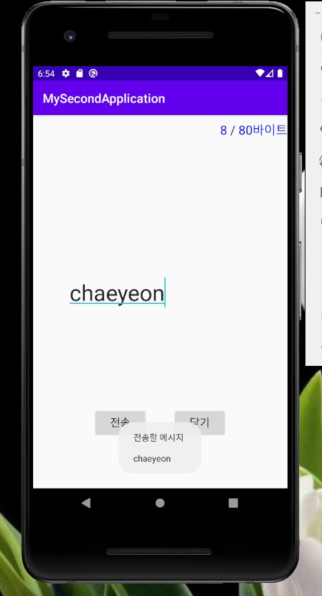

# 19173027 이채연

## 1주차 과제

## 2주차 과제
 </img>

## 3주차 과제
 </img>
 </img>
 </img>

## 4주차 과제
 - 아이디어 명 : 글씨체 교정 앱
 - 아이디어에 대한 설명 : 요새 글씨체 교정을 하면서 느낀건데 사람들이 좋아하는 유료 글씨체를 한 데 모아놓은 앱이 없어서 자신의 취향인 글씨체를 일일이 서치하는 것도 너무 어렵고, 찾는다고 해도 모니터를 쳐다보며 따라쓰는 것 밖에 방법이 없는 게 너무 불편했습니다. 글씨체 교정 앱 안에 다양한 유료 폰트들을 고를 수 있게 만들어서 폰트를 고르고 자신이 원하는 문장을 적어 PDF 파일을 생성할 수 있거나 혹은 아이패드 위에 바로 따라쓸 수 있는 기능을 만들면 좋을 것 같습니다. 

## 7주차 과제
 </img>
 </img>

## 10주차 과제
 </img>
 </img>
